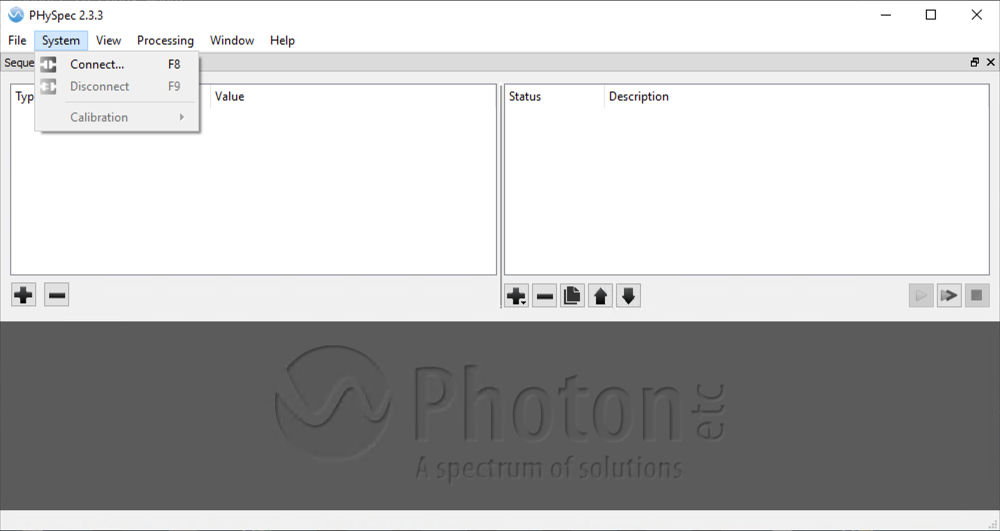
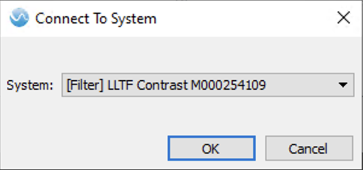

# Coronagraph Alignment

## Manual aligment

The best way to align the coronagraphs, currently, is manually using the VAMPIRES camera viewers. The process will be the same for each mask and we recommend aligning all masks to the internal source before going on-sky.

Start by inserting one of the masks using the camera viewer
* `CTRL + 8` - CLC-2
* `CTRL + 9` - CLC-3
* `CTRL + 0` - CLC-5
* `CTRL + -` - CLC-7
* `CTRL + =` - dgVVC

If the mask is far from centered, start with rough alignment by using `SHIFT` plus the arrow keys. When using the viewers the direction of the arrow key corresponds to the direction the mask will move.

Once close, use the fine alignment by pressing `CTRL` plus the arrow keys. When satisfied, press `CTRL + s` to save the current position.

## Focusing

The fieldstop stage can move along the focus axis with

```
sonne $ vampires_fieldstop f
```

The focus can also be adjusted in the camera viewers with `CTRL + ,` and `CTRL + .` (comma and period).

The fieldstop optic as well as the four classic-Lyot coronagraph (CLC) masks all should have the same focus position. These optics are all implemented as amplitude masks on the first surface of an optical window. The dgVVC mask has multiple layers and the optimal focus position is not the same as the CLC masks.

### Autofocusing

The fieldstop and CLC masks can be autofocused off-sky by optimizing the sharpness of the masks. This is best done using a flat lamp. It is easier to use the SCExAO integrating sphere source as a flat lamp than the NasIR calibration lamp. To set this up, first prepare the SCExAO bench by removing the source fiber and placing the integrating sphere in

```
sc2 $ src_fib out &
sc2 $ intsphere
```

Now, on the CHARIS computer turn the laser source on

```
mrclean $ charis laser enable
mrclean $ charis laser power=100
```

Lastly, make sure the tunable filter is set so that the first harmonic is in the VAMPIRES passband. The filter is controlled with the `nuller` NUC computer and requires Microsoft Remote Desktop protocol to connect. Once connected, launch "PHySpec" and connect the LLTF device




Once connected, make sure the filter is tuned to twice the desired wavelength in VAMPIRES, e.g. 1400 nm will produce a harmonic at 700 nm.


At this point you should see light in VAMPIRES. If not, see if there is light on the infrared bench and if so then check the VAMPIRES instrument status and increase exposure time or switch to slow readout mode. Slow readout mode at max framerate is usually sufficient for flat fields.

Now, insert one of the CLC masks- the CLC-7 mask has the largest dot so it is easier to see.
```
sonne $ vampires_fieldstop clc-7
```
now, run the following autofocus script, specifying which camera to use for measuring the sharpness metric:
```
sonne $ autofocus_fieldstop -c 1
```

Record the output- if unsatisfactory run again with a different starting position close to the expected focus position.

There is currently no easy way to save the focus value to multiple fieldstop configurations at once, so we recommend to directly edit `~/src/device_control/conf/vampires/conf_vampires_fieldstop.toml` directly and overwrite the `f= XX` values in the configurations for the
* Fieldstop
* CLC-2
* CLC-3
* CLC-5
* CLC-7
